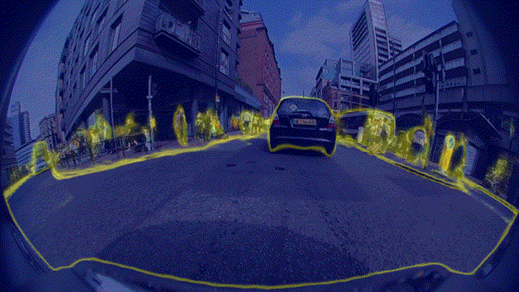

# DL-DIY potential project ideas
- extend idea to other segmentation datasets
- extend idea to extract bounding boxes from feature maps
- adapt to other semantic segmentation architectures
- related work: [ConfidNet](https://github.com/valeoai/ConfidNet)
-----------------

# Triggering Failures: Out-Of-Distribution detection by learning from local adversarial attacks in Semantic Segmentation
Victor Besnier, Andrei Bursuc, David Picard & Alexandre Briot 

In Proceedings of the IEEE/CVF International Conference on Computer Vision (ICCV) 2021

[Our paper](https://arxiv.org/abs/2108.01634)

## TL;DR
We present a new anomaly detection method for road semantic segmentation based on an observer network trained on the failure mode of the target network

Segmentation Prediction | Observer Uncertainty
--- | ---
 | 

## Abstract
In this paper, we propose a new method, named Observer Network, for OOD and error detection for semantic segmentation. 
We separate the segmentation and the error prediction by using a dedicated network to the later task, keeping the segmentation network unchanged.
We trigger failures of the Segmentation Network by applying Local Adversarial Attacks (LAA) on the input image during training. These images serve as proxy OOD to train the observer.  
We show that our method is fast, accurate and memory efficient on three different datasets and compare against multiple baselines.

##  Repository Structure
    ├ Obsnet/
    |    ├── Models/                                <- networks
    |    |      ├── load_net.py
    |    |      ├── obsnet.py
    |    |      └── segnet.py  
    |    |    
    |    ├── Dataset/                               <- loading  data
    |    |      ├── BDD_anomaly.py                  <- BDDAnomaly dataset     
    |    |      ├── camvid.py                       <- CamVid dataset     
    |    |      ├── load_data.py                    <- dataloader   
    |    |      ├── seg_transfo.py                  <- adapt pytorch data augmentation for segmentation     
    |    |      └── street_hazard.py                <- StreetHazards Dataset 
    |    |
    |    ├── Utils/                                 <- useful fct
    |    |      ├── adv_attack.py                   <- fct adversarial attacks      
    |    |      ├── affichage.py                    <- fct for plot viridis & segmentation map       
    |    |      ├── loss.py                         <- focal loss      
    |    |      ├── metrics.py                      <- metrics for evaluation     
    |    |      └── utils.py                        <- useful functions
    |    ├── ckpt/                                  <- models ckpt
    |    ├── logs/                                  <- tensorboard logs
    |    ├── train.py                               <- training the observer
    |    ├── evaluation.py                          <- test and evaluation
    |    ├── README.md                              <- me :) 
    |    └── main.py                                <- main

### Usage
    
    $ git clone https://github.com/valeoai/obsnet
    $ cd obsnet 
    $ conda env create --file requirements.yml  
    $ conda activate obsnet
      
### Datasets

#### CamVid
CamVid Dataset can be download here: http://mi.eng.cam.ac.uk/research/projects/VideoRec/CamVid/

The CamvidOOD dataset is composed of the same number of images as the classic CamVid. However, each image of the testing set contains an out-of-distribution animal.
You can download the CamVidOOD split in the release "CamVid OOD". Once CamVid and CamVidOOD are downloaded, execute the following line in your shell:
    
    $ cd /path/where/you/download/camvidood/
    $ unzip CamVidOOD.zip
    $ mv -r /path/where/you/download/camvidood/test_ood/ /path/to/dataset/CamVid/
    $ mv -r /path/where/you/download/camvidood/test_ood.txt /path/to/dataset/CamVid/
    $ mv -r /path/where/you/download/camvidood/testannot_ood/ /path/to/dataset/CamVid/
    
Folder Structure:

    ├ CamVid/
    |    ├ test/
    |    ├ testannot/
    |    ├ test_ood/
    |    ├ testannot_ood/
    |    ├ train/
    |    ├ trainannot/
    |    ├ val/
    |    ├ valannot/
    |    ├ test.txt
    |    ├ test_ood.txt
    |    ├ train.txt
    |    └ val.txt

To train an ObsNet on CamVid:

    python main.py --dset_folder "<path to dataset>" --segnet_file "<path to pretrain segnet>" --obsnet_file "./ckpt/camvid/" --data "CamVid" --tboard "./logs/camvid" --num_workers <nb workers> --bsize 8 --adv "min_random_patch" --epsilon 0.025 --lr 0.2 --nclass 12
     
To test:
    
    python main.py --dset_folder "<path to dataset>" --segnet_file "<path to pretrain segnet>" --obsnet_file "./ckpt/camvid/" --data "CamVid" --tboard "./logs/camvid" --num_workers <nb workers> --nclass 12 --test_only --test_multi "obsnet,mcp,mc_dropout" 

#### StreetHazards
Dataset can be download here: https://github.com/hendrycks/anomaly-seg

Folder Structure:

    ├ StreetHazards
    |    ├ annotations/
    |    |    ├ test/
    |    |    ├ training/
    |    |    └ validation/
    |    ├ images/
    |    |    ├ test/
    |    |    ├ training/
    |    |    └ validation/
    |    ├ README.txt
    |    ├ test.odgt
    |    ├ train.odgt
    |    └ validation.odgt

To train an ObsNet on Streethazards:

    python main.py --dset_folder "<path to dataset>" --segnet_file "<path to pretrain segnet>" --obsnet_file "./ckpt/streethazards/" --data "StreetHazard" --tboard "./logs/streethazards" --num_workers <nb workers> --bsize 6 --adv "max_random_patch" --epsilon 0.001 --lr 0.02 --nclass 14

To test:
    
    python main.py --dset_folder "<path to dataset>" --segnet_file "<path to pretrain segnet>" --obsnet_file "./ckpt/streethazards/" --data "StreetHazard" --tboard "./logs/bdd" --num_workers <nb workers> --nclass 14 --test_only --test_multi "obsnet,mcp,mc_dropout" 

#### BDD Anomaly
Dataset can be download here: https://github.com/hendrycks/anomaly-seg

Folder Structure:

    ├ BDD
    |    ├ bdd100k
    |    |    ├ seg
    |    |    |    ├ color_labels
    |    |    |    ├ images
    |    |    |    └ labels
    |    ├ test.odgt
    |    ├ train.odgt
    |    └ valiadation.odgt

To train an ObsNet on BDD Anomaly:    
    
    python main.py --dset_folder "<path to dataset>" --segnet_file "<path to pretrain segnet>" --obsnet_file "./ckpt/bdd/" --data "BddAnomaly" --tboard "./logs/bdd" --num_workers <nb workers> --bsize 6 --adv "max_random_patch" --epsilon 0.001 --lr 0.02 --nclass 19
    
To test:
    
    python main.py --dset_folder "<path to dataset>" --segnet_file "<path to pretrain segnet>" --obsnet_file "./ckpt/bdd/" --data "BddAnomaly" --tboard "./logs/bdd" --num_workers <nb workers> --nclass 19 --test_only --test_multi "obsnet,mcp,mc_dropout" 
        
## Citation
If you find this repository usefull, please consider citing our [paper](https://arxiv.org/abs/2108.01634):

    @incollection{besnier2021trigger,
       title = {Triggering Failures: Out-Of-Distribution detection by learning from local adversarial attacks in Semantic Segmentation},
       author = {Besnier, Victor and Bursuc, Andrei and Picard, David and Briot Alexandre},
       booktitle = {Proceedings of the IEEE International Conference on Computer Vision},
       year = {2021}
       url= {https://arxiv.org/abs/2108.01634}
    }
